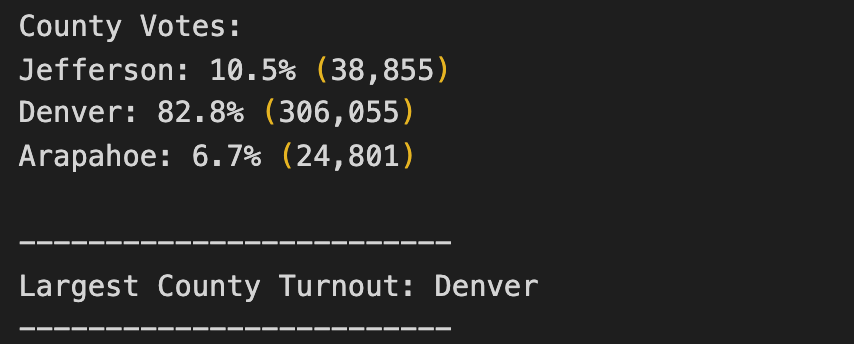
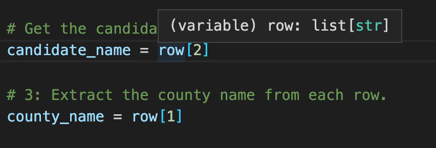

# Election Analysis  

## Overview of Election Audit
A Colorado Board of Elections employee has given the following tasks to complete the election audit of a recent local congressional election. We will use Python language code for this analysis. 

1. Calculate the total number of votes cast
2. Get a complete list of counties which participate in the election 
3. Calculate the total number of votes each county received 
4. Determime the county which received the most votes
5. Get a complete list of candidates who received votes
6. Calculate the total number of votes each candidate received 
7. Calculate the percentage of votes each candidate won
8. Determine the winner of the election based on popular vote

### Resources
- Data Source: election_results.csv
- Software: Python 3.7.6, Visual Studio Code  1.63.2

## Election Audit Results
The analysis of the election show that 
- There where 369,711 votes cast in the election 
- The counties are:
  - Jefferson
  - Denver
  - Arapahoe
- The candidates where: 
  - Charles Casper Stockham
  - Diana DeGette
  - Raymon Anthony Doane
- The candidates results were: 
  - Charles Casper Stockham received 23.0% and 85,213 votes
  - Diana DeGette received 73.8% and 272,892 votes
  - Raymon Anthony Doane received 3.1% and 11,606 votes
- The winner of the election was: 
  - Diana DeGette who received 272,892 votes and 73.8% of the vote.

## Election Aduit Summary 
If the election commission would like to use this code for any election, some changes will be needed. In the creation of the **election_analysis.txt** you will have to change the word "counties" for state, countries or even provinces, depending on the case of the election. 

    

  
Lastly, depending on the order of the columns in the election_results.csv, you will need to change the index of the list that you want to read, for example, sometimes candidate_name will be located at row[1] and county_name at row[2]. 

    

 